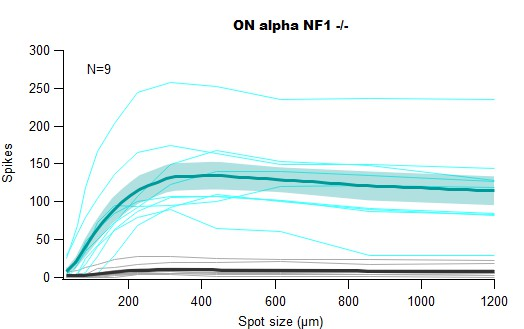
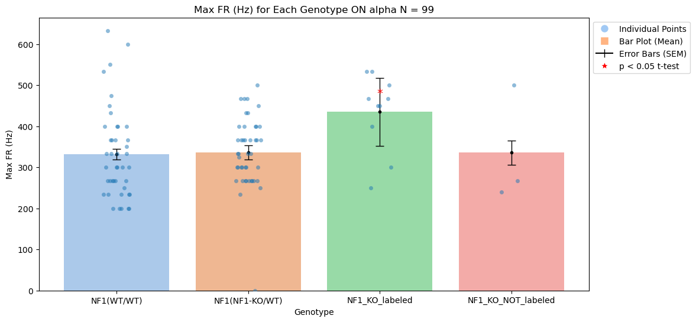
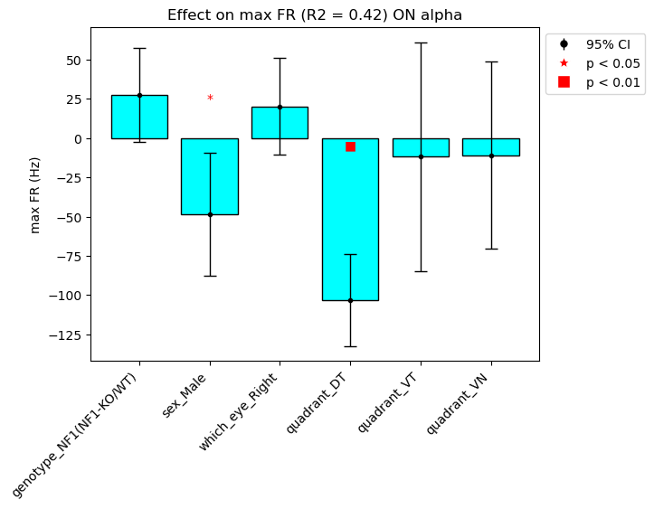

# NF1 Ephys Data
For these experiments, we recorded from the three Alphas ganglion cell types in loose-seal cell attached configuration while present light stimuli of different diamaters (30 to 1200 um). We measured:
- Baseline firing rate before the light stimuli
- Peak firing rates (Hz)
- Peak Spot Size: the size of the light stimuli which elicited the most spikes. 
- Peak spike count: maximum number of spikes elicited by the light stimuli. 

## SMS spike curves 
**Example figure:** 

- These are created directly from the `NF1.h5` file located in [Data_final](Data_final).
- It has the following hierarchy: **animal_type (NF1_control, NF1_het, NF1_homo)-> celltype -> cellname.**  

- For each cell, on the Y axis we plotted `spikes_stim_mean` for the ON response (cyan) and `spikes_tail_mean` for the OFF response (gray) and then computed the mean (darker lines). The SEM (shaded areas) are also part of the HDF5 file `spikes_stim_sem` and `spikes_tail_sem` for the ON and OFF response, respectiviel. 

## Mean and t-tests
**Example figure:**

In the [result_tables](result_tables) directory there are `.csv` files for every celltype which include the relevant genotype,sex, eye side,quadrant and cell_type information and it's responses. Attached is also the Jupyer Notebook [NF1_Analysis](NF1_Analysis.ipynb) to created plot the individual points, mean and run t-tests correcting for multiple comparisons.  

## Linear Mixed effects models
Example figure:

We ran linear mixed effects models using the `fitlme` function in Matlab and exported it results as CSVs [result_tables/Model_output](result_tables/Model_output). Also is attached the Jupyter Notebook [LME_results](LME_results.ipynb)

